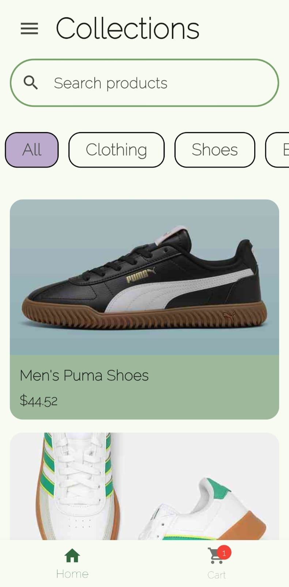
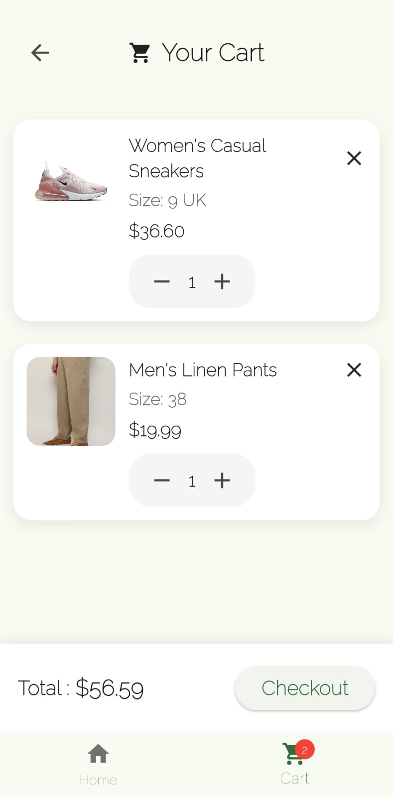
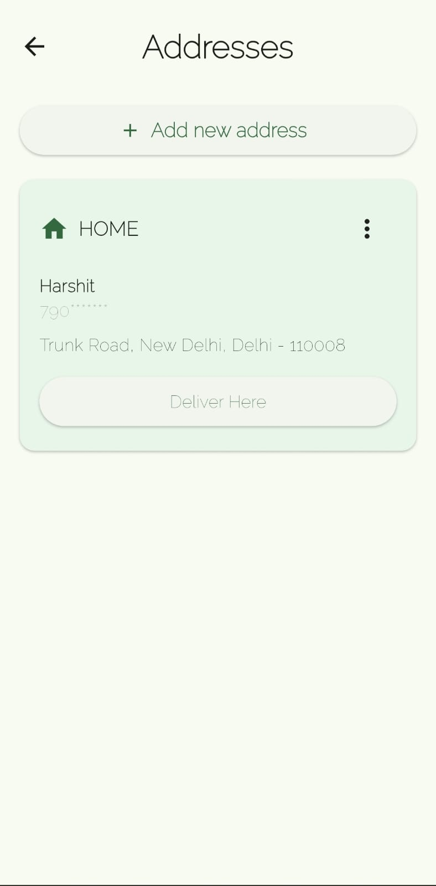
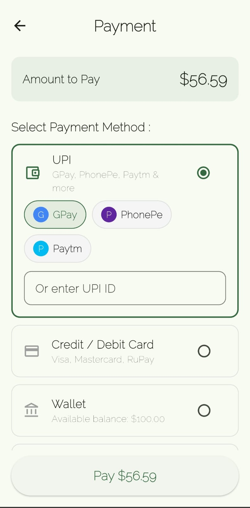
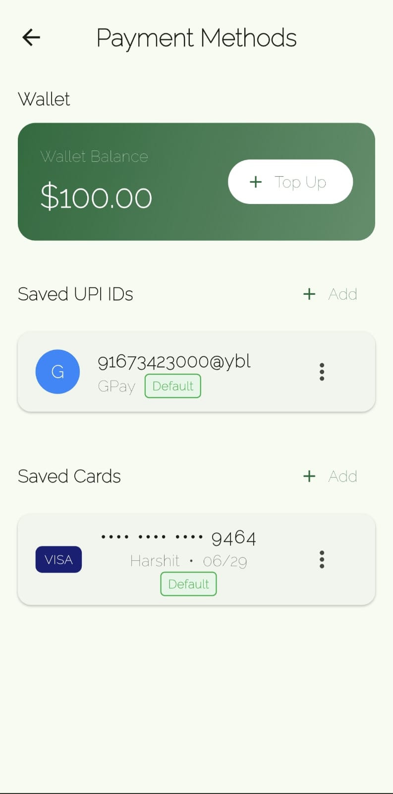
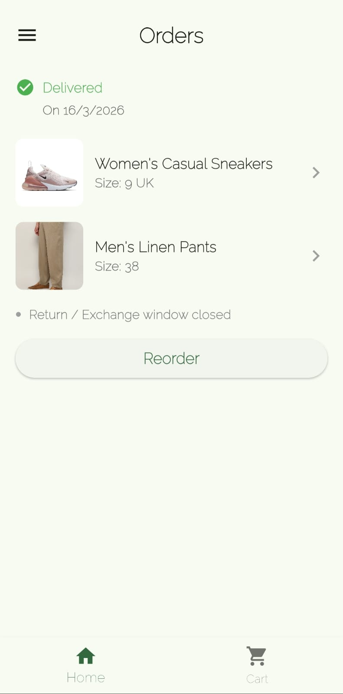

# shopping_app


# **Collections**

A full-featured e-commerce mobile app built with Flutter and Firebase.
#  Collections

A full-featured e-commerce mobile app built with Flutter and Firebase.


##  Features

-  **Authentication** — Email/password login & signup with session persistence
-  **Product Browsing** — Browse products by category with detailed product pages
-  **Cart Management** — Add, remove, update quantities with live badge counter
-  **Address Management** — Save multiple addresses (Home/Work/Other) with edit & delete
-  **Payment Flow** — UPI, Credit/Debit Card, Wallet & Cash on Delivery
-  **Saved Payment Methods** — Save UPI IDs and cards, set defaults, top up wallet
-  **Order Management** — Place orders, view history, reorder previous purchases
-  **Real-time Sync** — All data persisted to Firestore across sessions

##  UI

| Login | Home | Product | Cart |
|-------|------|---------|------|
|  |  |  |  |

| Address | Payment | Payment Methods | Orders |
|---------|---------|----------------|--------|
|  |  |  |  |

## Tech Stack

| Technology | Usage |
|------------|-------|
| Flutter | UI Framework |
| Firebase Auth | Authentication |
| Cloud Firestore | Database |
| Provider | State Management |
| Shared Preferences | Local Storage |

##  Project Structure
```
lib/
├── main.dart                      # App entry point
├── auth_wrapper.dart              # Auth state routing
├── login_screen.dart              # Login
├── signup_screen.dart             # Signup
├── main_screen.dart               # Root screen with bottom nav
├── home_page.dart                 # Product listing
├── product.dart                   # Product model
├── product_card.dart              # Product card widget
├── product_details_page.dart      # Product detail screen
├── cart_provider.dart             # Cart + Orders state
├── cart_page.dart                 # Cart screen
├── cart_item.dart                 # Cart item model
├── cart_badge_icon.dart           # Cart badge widget
├── address.dart                   # Address model
├── address_provider.dart          # Address state
├── address_screen.dart            # Address management screen
├── address_form.dart              # Add/Edit address form
├── checkout_screen.dart           # Checkout summary
├── order.dart                     # Order model
├── order_details_screen.dart      # Order detail screen
├── order_history_page.dart        # Order history
├── order_history_screen.dart      # Order history screen
├── order_details_page.dart        # Order details page
├── payment_screen.dart            # Payment screen
├── payment_methods_provider.dart  # Payment methods state
├── payment_methods_screen.dart    # Saved payment methods
├── success_screen.dart            # Order success screen
├── app_drawer.dart                # Navigation drawer
└── navigation_helpers.dart        # Navigation utilities
```

## Getting Started

### Prerequisites
- Flutter SDK (3.0+)
- Firebase project

### Setup

1. **Clone the repo**
```bash
git clone https://github.com/Harshit-0413/shopping_app.git
cd shopping_app
```

2. **Install dependencies**
```bash
flutter pub get
```

3. **Firebase Setup**
   - Create a Firebase project at [console.firebase.google.com](https://console.firebase.google.com)
   - Enable **Authentication** (Email/Password)
   - Enable **Cloud Firestore**
   - Download `google-services.json` and place it in `android/app/`
   - Download `GoogleService-Info.plist` and place it in `ios/Runner/`

4. **Run the app**
```bash
flutter run
```

##  Firestore Structure
```
users/
  {uid}/
    cart/           # Cart items
    orders/         # Order history
    addresses/      # Saved addresses
    savedCards/     # Saved cards (masked)
    savedUpis/      # Saved UPI IDs
    wallet/
      balance/      # Wallet balance
```

##  Dependencies
```yaml
firebase_core: ^3.6.0
firebase_auth: ^5.3.0
cloud_firestore: ^5.6.12
provider: ^6.0.5
shared_preferences: ^2.5.4
uuid: ^4.5.3
```
## License
This project is open source and available under the [MIT License](LICENSE).

##  Author

**Harshit**  
[LinkedIn](https://www.linkedin.com/in/harshit-singh-aa1248330?utm_source=share&utm_campaign=share_via&utm_content=profile&utm_medium=android_app) • [GitHub](https://github.com/Harshit-0413)